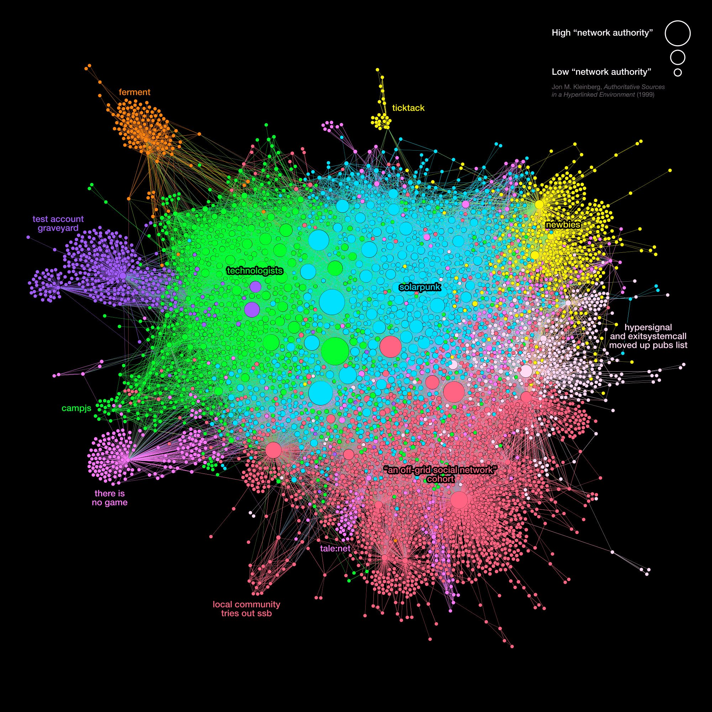
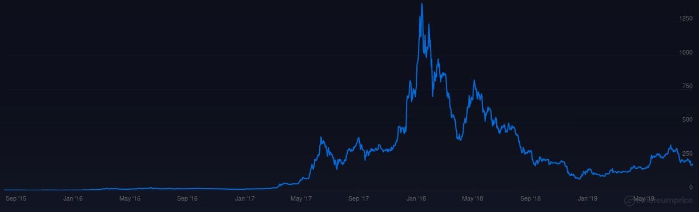
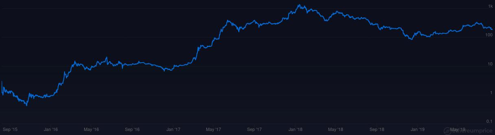
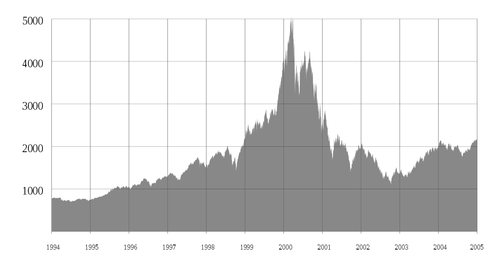

# Secure Scuttlebutt & p2p infrastructure

  @dominictarr

  @EMovhfIrFk4NihAKnRNhrfRaqIhBv1Wj8pTxJNgvCCY=.ed25519

  Secure Scuttlebutt & LeastAuthority

---

* many private blockchains
* proof of stake
* each with single staker

  #notablockchain

---

  many chains, tangled together

---

  no such thing as a "full node"

---

  zombie apocalypse ready

---

safe assumption: Social Statistical Pattterns

---

---

# popular applications

  * talk to people
  * play chess
  * use git
  * and more...

---

# implementations

  * javascript/node (reference)
  * go
  * rust (underway)

---

#  development goal: use value

---

---

---

---

lessons of web 1 and 2

* users = value
* fail fast & iterate

---

# scuttlebutt + ethereum

prototypical dapp is a "market"

---

# market

* mostly information exchange (ssb)
* then a transaction (eth)

---

# development

* smart contracts are like hardware
* p2p is "software"

---

* simplest smart contract
* full node + "notary" on ssb (etc)
* users are clients to full nodes

---

# attacks

* notary shows incorrect data
* notary witholds data

---

# natural incentive

* notary invested in the market

---

# user layer

* web interface (federated)
* ssb peers (decentralized)

---

# take away

eventual consistency
